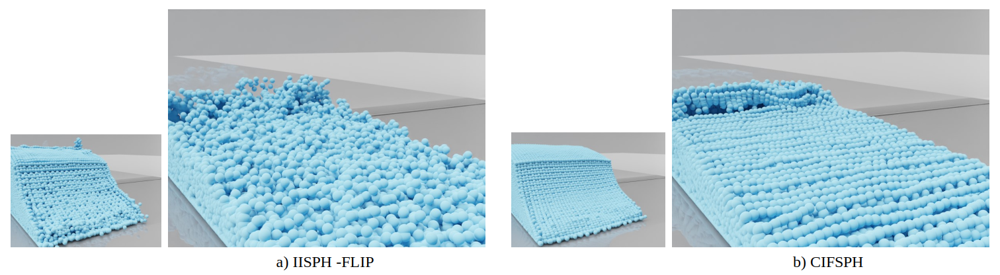
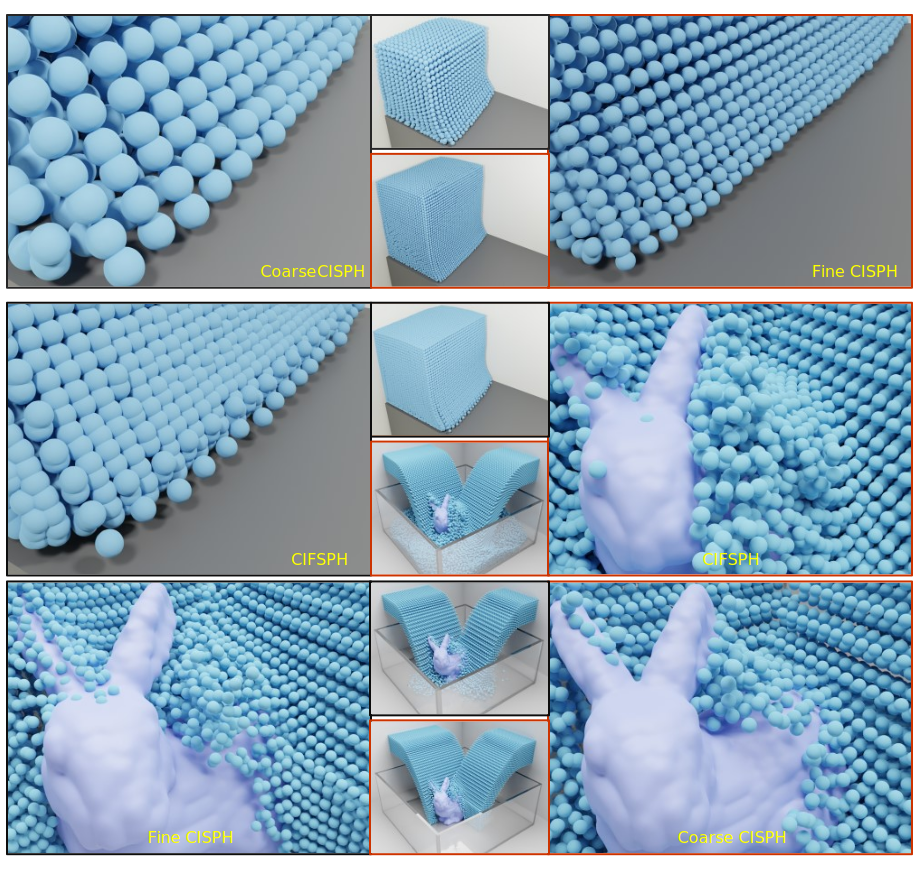

# CIFSPH: Coupling Incompressibility Fine Smoothed Particle Hydrodynamics

Coupling Incompressibility Fine Smoothed Particle Hydrodynamics (CIFSPH), a more efficient algorithm for incompressible fluid simulation, which is comparable with the existing methods on the computational accuracy.

The algorithm is implemented by C++ and CUDA C++ for the part of GPU parallel accelerated computing.

This repo also includes the implementations of IISPH, DFSPH, CISPH.

## Requrirements
* CUDA 8.0
* Visual Studio 2015
* Windows 10 or 11

## Acknowledgements
This code is partly based on Gfans's [ISPH_NVIDIA_CUDA_CONTEST](https://github.com/Gfans/ISPH_NVIDIA_CUDA_CONTEST).
